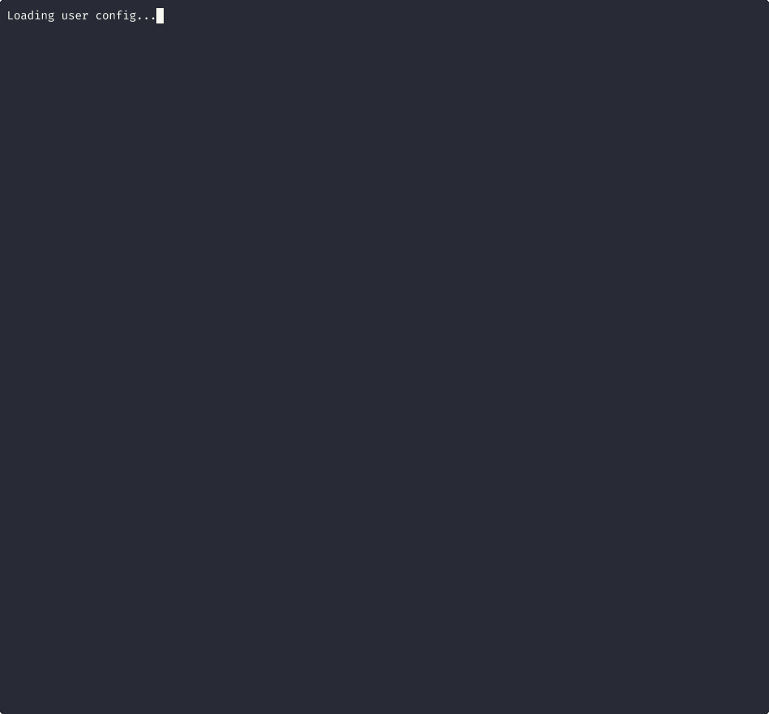

# MCP Chat

Using MCP (Model Context Protocol) servers as chat clients.

I was initially inspired to make this based upon an idea for a chat roulette style interaction using an MCP client like the Claude Mac app or the Claude Code. For simplicity's sake, this proof of concept just uses a simple in-memory room-based system that supports two users in a single room sending messages between each other.



## What?

MCP is designed for AI assistants to call tools. This project abuses that design to let humans chat with each other through tool calls. A long polling tool is used to wait for messages from the recipient. This is not ideal. Ideally, we'd be using custom notifications, but the MCP clients that I'm working with and most MCP clients today do not support custom messages/notifications.

## How it works

Run the MCP server in using the SHTTP transport:
```bash
# Terminal 1
uv sync
uv run fastmcp run mcp_chat/server.py --transport http
```

Connect to the MCP server using Claude Code, for example:

*Note*: See the demo gif for an example of using this with Claude Code

```bash
claude mcp add --transport http mcp-chat -s project -- http://localhost:8000/mcp
claude # Do this in 2 separate sessions
```

The magic: `wait_for_message` blocks until a message arrives. Real-time chat through long-polling.

## Tools

- `join_room` - Create/join a room
- `send_message` - Send a message
- `wait_for_message` - Wait for messages (blocks!)
- `leave_chat` - Leave the room

## Requirements

- Python 3.11+
- [uv](https://github.com/astral-sh/uv) package manager

## Future ideas

- Random pairing (chat roulette style)
- Custom notifications for async messaging
- Multi-user rooms
- Message history

## Why?

Sunday project. Wanted to see if MCP could be bent into a chat protocol. Turns out it can.

## License

MIT
